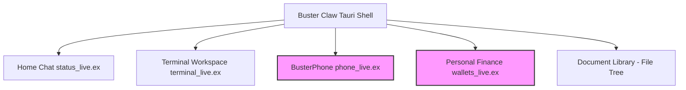
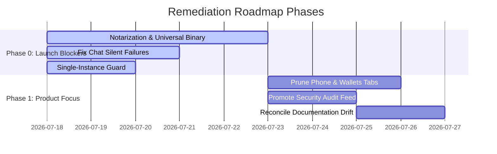

# Buster Claw — Customer First-Look & QA Critical Review

> **ARCHIVED 2026-07-18 — redundant.** Same-day subset of `../roadmaps/FIRST_LOOK_CRITICAL_REVIEW.md`, which carries the `file:line` anchors and the tiered punch list. Findings are tracked there; nothing unique to this doc was dropped.

**Date:** July 17, 2026  
**Product Version:** 0.1.0  
**Target Persona:** A QA Engineer or new customer who has downloaded the release DMG. They are familiar with competitor "claw" runtimes (e.g., Open Claw, Zero Claw, Hermes) and expect a polished, security-hardened, and functional out-of-the-box experience.

---

## Executive Summary: The Dual Nature of Buster Claw

The core verdict of this review is simple: **Buster Claw's underlying engineering is exceptionally strong, but its user-facing presentation is cluttered, blocked, and confused.** 

Deep within the codebase, there are world-class implementations of local security primitives. The token-based trust tier system in [BusterClaw.Commands](file:///Users/lukehightower/Developer/buster-claw/lib/buster_claw/commands.ex) is robust, and the SSRF/DNS-rebinding defenses in `BusterClaw.URLGuard` are far ahead of competitor standards. 

However, a new user downloading the application today is met with a succession of brick walls:
* **The Gatekeeper blocker:** A raw, unsigned, Intel-only DMG that modern macOS security outright rejects.
* **The Onboarding blocker:** Gated behind a manual email loop to the founder to bypass Google's OAuth "Testing" limits, and requiring pre-installed Homebrew.
* **The Chat failure:** Silent crashes and swallowed stdout/stderr when Claude Code isn't authenticated.
* **Scope Creep & Noise:** An over-engineered personal finance tracker (Wallets), decorative telephony widget (Phone), and fragile home-screen shaders that dilute the core pitch.

Buster Claw tries to be five products at once—a local agent runtime, a Gmail triage daemon, a conversational chat window, an answering machine, and a personal ledger. To succeed against focused competitors, the application must prune the noise, expose its hidden security differentiators, and pave a frictionless path to the first run.

---

## 1. The Installation & First-Launch Wall (First Ninety Seconds)

This leg of the journey contains the most damaging experience: blockers that occur before the application can even render a single pixel.

### 1.1 macOS Gatekeeper Rejection (Blocker)
The shipped desktop application is built via Tauri but carries no code-signing identities or Apple notarization configurations. `desktop/tauri/tauri.conf.json` does not declare a signing certificate, and `desktop/tauri/Entitlements.plist` is a blank dictionary. 
* **User Impact:** On modern macOS versions (Sequoia and newer), double-clicking the DMG triggers a hostile OS dialogue declaring the software "damaged" or warning that "Apple cannot check it for malicious software," with the only action button being "Move to Trash."
* **Fix Needed:** Procure an Apple Developer certificate, integrate Tauri notarization hooks, and provide a user-friendly instruction block for local bypasses if running self-built builds.

### 1.2 Intel-only Architecture on Apple Silicon (Blocker)
The DMG bundles an `x86_64` (Intel) compilation of the Erlang Runtime System (ERTS) and the Tauri binary wrapper.
* **User Impact:** Because nearly all modern Macs are Apple Silicon (M-series), this forces macOS to fall back on Rosetta 2 translation. If Rosetta is not pre-installed, the launch fails with a generic system crash. Furthermore, the BEAM runs slower under translation, risking timeouts during the Tauri health check loop in `desktop/tauri/src/main.rs`.
* **Fix Needed:** Update the release compilation pipeline in `scripts/build_desktop.sh` to target `aarch64-apple-darwin` or produce a universal fat binary.

### 1.3 Database Corruption via Multi-Instance Launches (Major)
There is no single-instance lock registered in Tauri.
* **User Impact:** If a user accidentally triggers the application twice (e.g., via CLI or script), two independent BEAM nodes boot up. Both attempt to open the shared SQLite database located at `~/Library/Application Support/BusterClaw/buster_claw_dev.db`. This concurrency leads to SQLite lock contentions, write errors, and double-triggers in background supervisors like `BusterClaw.RateLimiter` and `BusterClaw.DispatchProjector`.
* **Fix Needed:** Configure the `tauri-plugin-single-instance` plugin inside `desktop/tauri/src/main.rs` to reject secondary process initializations and focus the active window.

### 1.4 Stale / Broken launchd Persistence (Major)
The offline orchestration guide and [BusterClaw.Orchestration.Uptime](file:///Users/lukehightower/Developer/buster-claw/lib/buster_claw/orchestration/uptime.ex) mention automatic reboot recovery using a launchd plist KeepAlive task.
* **User Impact:** In the shipped DMG, this plist is never installed because the installation logic resides in `scripts/install_launchd.sh`, a repo script excluded from the packaged bundle. If the script *were* run, it sets `KeepAlive=true`, making the desktop application impossible to quit (using CMD+Q) while on duty, relaunching the window every ten seconds without explanation.
* **Fix Needed:** Build an in-app toggle for background persistence and use proper `launchctl` commands via Tauri sidecars instead of raw repository scripts.

---

## 2. Onboarding & Dependency Verification (The Four Dots)

Onboarding is managed in [BusterClawWeb.SetupLive](file:///Users/lukehightower/Developer/buster-claw/lib/buster_claw_web/live/setup_live.ex). While the visual wizard is clean, its assumptions are fragile.

### 2.1 The Homebrew Blocker (Major)
The wizard prompts the user to install the agent CLI by typing a pre-filled command into a mock terminal panel, which executes `brew install --cask claude-code`.
* **User Impact:** If the user has a clean machine without Homebrew installed, the command fails opaquely with a `command not found: brew` error. The wizard offers no explanation, detection logic, or alternative curl-based installation paths.
* **Fix Needed:** Detect whether `brew` is available. If missing, guide the user to the official Node/NPM installation commands (`npm install -g @anthropic-ai/claude-code`) or curl scripts.

### 2.2 Claude Login Assumption (Major)
[BusterClaw.Setup](file:///Users/lukehightower/Developer/buster-claw/lib/buster_claw/setup.ex) verifies the presence of the agent CLI (`claude` or `codex`) via `System.find_executable/1`.
* **User Impact:** It only checks if the binary *exists*, never that it is authenticated. If a user completes onboarding but has never run `claude login` in their terminal, the agent launches headlessly but immediately terminates with authentication errors. The app reports no feedback, leading the user to believe the program itself is broken.
* **Fix Needed:** Add a verification step that runs `claude --version` or a lightweight dry-run check to verify login status before allowing the user to proceed.

### 2.3 The Weekly Google Token Expiry (Major)
Because the application's built-in Google OAuth client credentials are in Google Cloud's "Testing" status, a maximum of 100 test users can connect, and refresh tokens expire every 7 days.
* **User Impact:** New users cannot authenticate Google Workspace out-of-the-box. The wizard forces them to click a "Request access" button which generates an email to `lukehightower11@gmail.com` to be manually whitelisted. Even when whitelisted, their session expires weekly, silently stopping the agent's background email triage loop.
* **Fix Needed:** Complete the Google verification process to move the OAuth app to "In Production", or prioritize the "Bring Your Own Credentials" setup path for advanced users.

---

## 3. The Home Chat Interface (StatusLive)

The conversational chat interface on the Home screen ([BusterClawWeb.StatusLive](file:///Users/lukehightower/Developer/buster-claw/lib/buster_claw_web/live/status_live.ex)) is the default landing zone. It suffers from a "silent-failure" design.

### 3.1 Swallowed CLI Failures (Blocker)
When the user sends a message, `BusterClaw.Agent.Chat` spawns the Claude CLI using [BusterClaw.AgentRunner](file:///Users/lukehightower/Developer/buster-claw/lib/buster_claw/agent_runner.ex). 
* **User Impact:** If the Claude CLI exits with a non-zero code (due to rate limits, token depletion, or network drops), the chat loop audits this as a `:completed` run. Stderr output is discarded, and the user is left with a loading indicator that stops spinning, displaying a cost bubble showing `$0.00` and no reply.
* **Fix Needed:** Capture stderr. If the exit status is non-zero, parse the error and bubble it up to the UI as a clear alert (e.g., "Claude CLI exited with error: Rate Limited").

```elixir
# Current problematic implementation in chat.ex:
def handle_info({port, {:exit_status, status}}, socket) do
  # Audits success regardless of non-zero status
  record_completed_run(socket)
  {:noreply, socket}
end
```

### 3.2 Plaintext Markdown Render (Major)
While Buster Claw includes a dedicated `BusterClaw.Markdown` rendering module, the chat panel bubble (`chat_panel.ex`) prints raw text inside a `whitespace-pre-wrap` block.
* **User Impact:** Bold markers (`**text**`), headings, and code blocks appear as literal characters. Code snippets are unformatted and have no "Copy" buttons, which is highly frustrating for developers.
* **Fix Needed:** Pass message text through the markdown parser and style the resulting HTML with Tailwind typography styles.

### 3.3 Resource-Intensive Shader Background (Major)
The home screen runs a WebGPU fragment shader background (`SmokeBackground`). 
* **User Impact:** There is no toggle to disable it, unlike the terminal background which supports `"off"`. On older Macs or devices with high-DPI screens, this fragment shader runs at 60fps, causing high CPU/GPU spikes, draining battery life, and heating up laptops. On machines without WebGPU, it renders as a blank void.
* **Fix Needed:** Add a "Static / Off" option in the Appearance tab and fall back gracefully to a dark slate background.

---

## 4. Scope Creep & Redundant Modules (The "Five Products" Problem)

Buster Claw suffers from significant feature bloat that dilutes its core selling point (secure agent runtime + audit trail) and creates a confusing user experience.



### 4.1 The Decorative Telephony Tab (BusterPhone)
The "Phone" tab is prominently placed in the main dock. It features custom WebGPU waveform rendering and costs ledger charts.
* **User Impact:** In the shipped DMG, this feature is completely non-functional. It requires env vars (`SUPABASE_URL`, `TWILIO_ACCOUNT_SID`) that a Tauri application launched from the Finder cannot inherit, and there is no in-app settings UI to supply them. The SMS and outbound call features are unbuilt stubs, and the dialpad is purely decorative. A user clicking this tab will conclude the application is broken.
* **Fix Needed:** Hide the Phone tab by default. Introduce it under a "Labs" or "Developer Setup" flag only when Twilio/Supabase credentials are valid.

### 4.2 The Wallets / Mint Ledger Over-Engineering
`BusterClawWeb.WalletsLive` is a 900-line personal finance and bookkeeping dashboard for tracking income, expenses, and model costs.
* **User Impact:** It has nothing to do with a local agent runtime. It complicates the database schema, introduces unnecessary state polling, and confuses users who expected a clean developer tool.
* **Fix Needed:** Deprecate the Wallets tab or decouple the model-cost tracking logic into a lightweight "Developer Billing" widget under Settings, dropping the business ledger entirely.

---

## 5. Security & Trust Architecture Holes

Buster Claw positions itself as a security-focused runtime, but several severe structural loopholes undermine this claim.

### 5.1 Sentinel Bypass via Shell Execution (Blocker)
The security audit feed ([BusterClaw.Sentinel](file:///Users/lukehightower/Developer/buster-claw/lib/buster_claw/sentinel.ex)) monitors actions dispatched through the [BusterClaw.Commands](file:///Users/lukehightower/Developer/buster-claw/lib/buster_claw/commands.ex) API.
* **Security Gap:** Because the Claude Code CLI runs with `--permission-mode bypassPermissions` directly in the user's terminal/shell session, the agent can execute arbitrary shell commands (`rm -rf`, `curl`, read `~/.ssh/id_rsa`) without ever calling the Elixir command facade. These shell actions completely bypass the Sentinel log, the `BusterClaw.PolicyEngine`, and the rate limiter.
* **User Impact:** A user looking at the Security tab sees a clean audit log of "safe" actions, unaware that the agent may have run malicious shell scripts in the background.
* **Fix Needed:** Clearly document this boundary. Implement a terminal sandbox or terminal command inspector that streams shell command executions directly into the Sentinel audit feed.

### 5.2 Stubbed Approval Gates (Major)
The policy engine can return a `{:confirm, meta}` decision, which is supposed to prompt the user to approve or deny a gated command.
* **User Impact:** The approval workflow is unbuilt. `BusterClaw.Sentinel.Pending` is merely an in-memory stub that records the request but offers no UI hooks to authorize it. Restricted commands are effectively blocked, and the user has no way to allow them from the UI.
* **Fix Needed:** Build the LiveView approval modals for pending events, or simplify the policy engine to return binary `allow`/`deny` decisions until the interactive approval loop is fully built.

### 5.3 Plaintext Local Storage (Major)
Although API tokens are encrypted in the database (or stored in the macOS Keychain), other highly sensitive local tables are written in cleartext.
* **Security Gap:** Browser history, contacts lists, incoming email subjects/bodies (stored in `dispatch_items`), and the wallets ledger are saved in plaintext inside the SQLite database. Anyone with access to the local machine can read these via standard SQLite viewers.
* **Fix Needed:** Leverage SQLCipher or apply the application's AES-256-GCM vault module to encrypt fields holding sensitive PII (emails, transaction histories, and contact names).

---

## 6. Comparison with Competitors (Open Claw / Zero Claw / Hermes)

When compared side-by-side with similar tools, Buster Claw's relative positioning is distinct:

| Feature | Open Claw / Zero Claw | Hermes | Buster Claw (Current) |
| :--- | :--- | :--- | :--- |
| **Model Customization** | Pick any API provider/key | Local & Remote LLM hooks | Hardcoded to local `claude`/`codex` |
| **Execution Path** | Single CLI or clean chat window | Multi-agent sandbox UI | Redundant (Chat + Terminal + Queue) |
| **Telemetry & Health** | Minimal / Developer logs | Basic telemetry dashboard | None (Fully blind offline status) |
| **Security Audit** | None / Simple console output | None | **Redacted, token-tiered Sentinel feed** |
| **State Durability** | Memory only (lost on crash) | Ephemeral db files | **Durable queue projected into Markdown** |

### Differentiator Focus
Buster Claw's biggest strength is the **durable Markdown task queue** (`shift/Dispatch.md`) and the **redacted Sentinel audit feed**. Competitors do not offer this degree of accountability. Unfortunately, Buster Claw buries the Sentinel audit feed at the bottom of the Settings sub-navigation (tab 7), while highlighting less relevant widgets.

---

## 7. Prioritized Remediation Roadmap

To transition Buster Claw from a developer's private playground into a distributable, reliable beta product, we recommend the following phased action plan:



### Phase 0: Launch-Critical Fixes (Must Ship First)
1. **DMG Signing & Arm64 Support:** Configure Developer ID signing, entitlements, and build universal binaries to bypass macOS Gatekeeper blocks.
2. **Expose Agent CLI Failures:** Modify `Chat` and `AgentRunner` to capture binary execution errors and display them directly in the chat panel with helpful troubleshooting instructions (e.g., "Run `claude login` in your terminal").
3. **Add Single-Instance Locks:** Prevent database corruption and duplicate background pollers by blocking secondary app launches.
4. **Relocate Google OAuth to Production:** Eliminate the manual email whitelisting loop and weekly token expirations.

### Phase 1: UX Cleanliness & Focus
5. **Clean Up the Main Dock:** Hide the unconfigured Phone tab and the over-built Wallets tab behind a "Labs / Advanced Features" flag in Settings. Keep the primary interface focused on the **Chat**, **Terminal**, and **Security Feed**.
6. **Move Security to the Top:** Make the Sentinel feed highly visible. Add a badge in the main navigation showing the count of pending or refused actions.
7. **Fix Document Stale Links:** Update `introduction.md` and `setup.md` to match the actual 5-step onboarding wizard, removing references to retired scheduler and database-backed memory features.

### Phase 2: Security Hardening
8. **Encrypt Database PII:** Apply AES-256-GCM encryption to columns storing email bodies, contacts, and browser histories in the SQLite db.
9. **Implement Terminal Command Streaming:** Stream terminal commands into the Sentinel log to ensure operations running outside the `BusterClaw.Commands` API are accounted for.
10. **Build Interactive Gated Approvals:** Connect `Sentinel.Pending` to a functional LiveView UI that allows users to click "Approve" or "Deny" on gated command requests.

---

## Conclusion

Buster Claw has the core primitives necessary to be a highly secure, reliable agentic runtime. The local vault, the DNS-rebinding guards, and the markdown task queue are exceptional engineering choices. By removing the decorative features, refining the onboarding flow, and highlighting the security audit logs, the application can offer a focused, premium, and reliable experience that stands out in the crowded ecosystem of agent runtimes.
