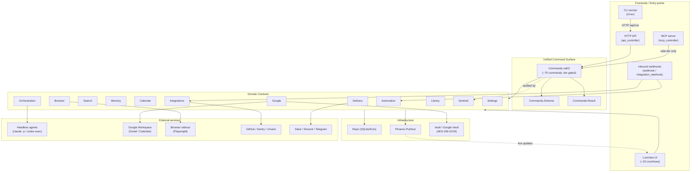
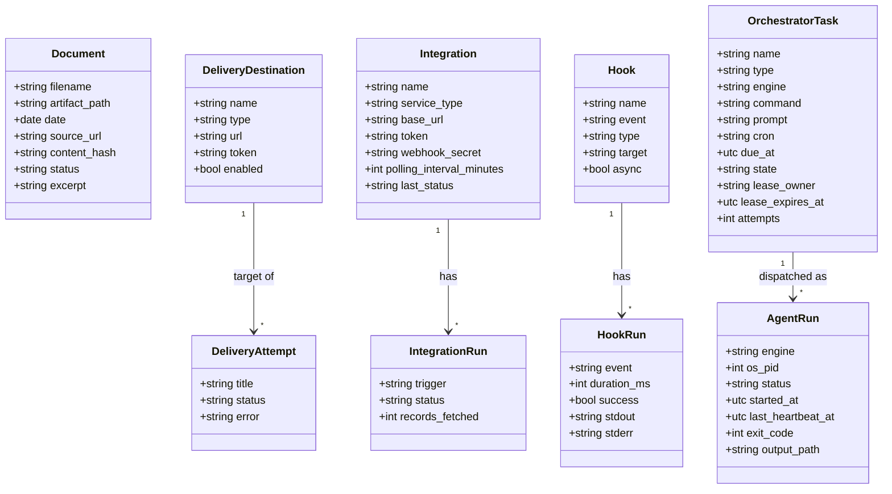
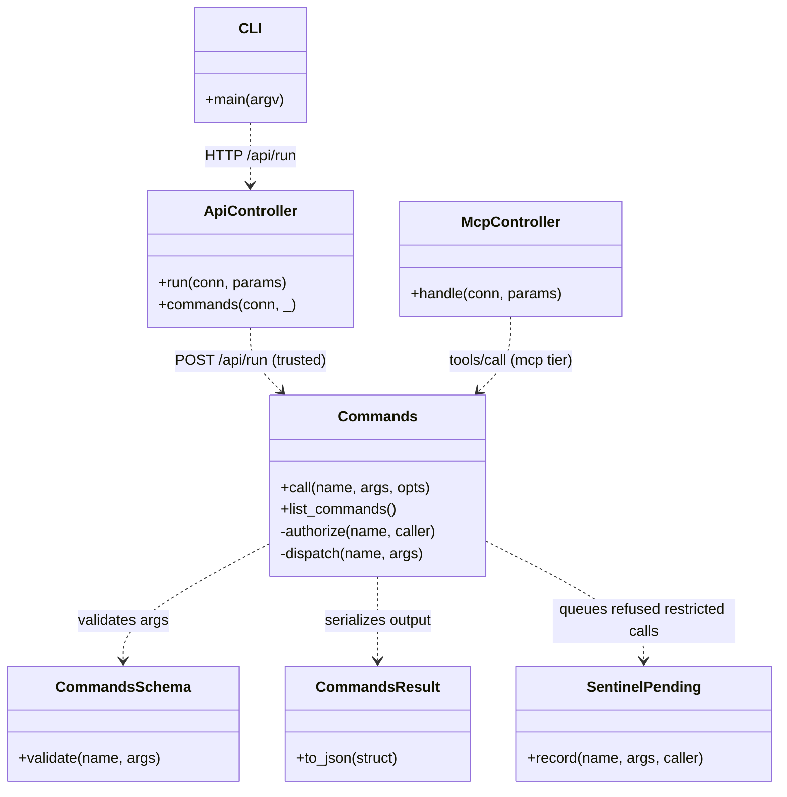
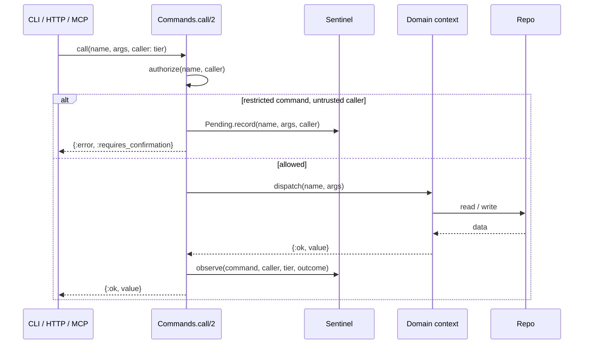
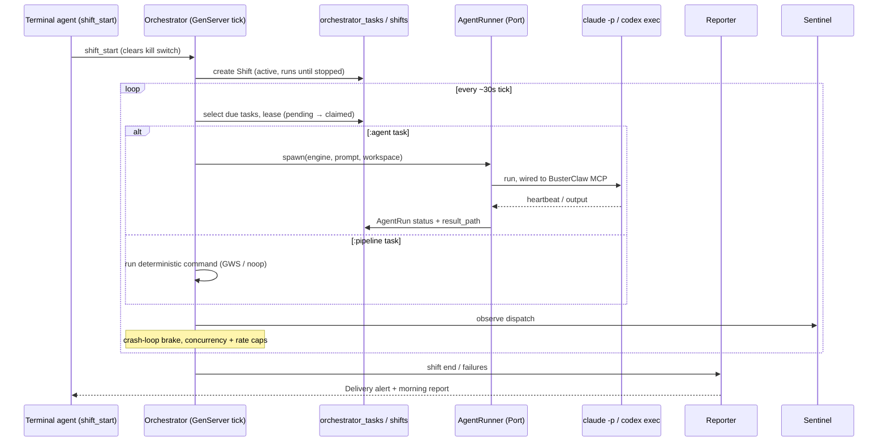
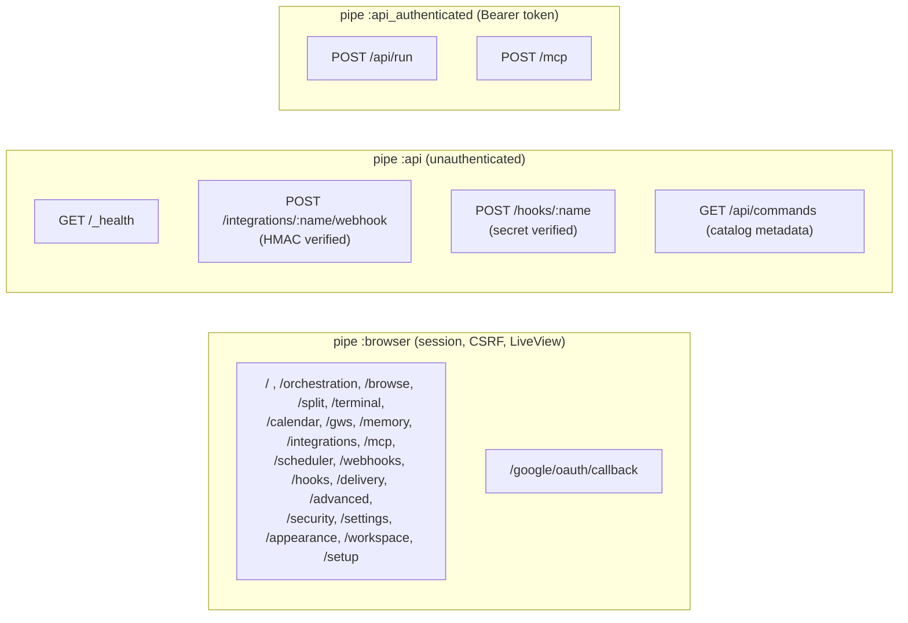

# Buster Claw — UML / Architecture Diagrams

Mermaid diagrams describing both the **structure** (modules, schemas, supervision) and the
**functionality** (request flows) of the codebase. Rendered automatically by GitHub and most
Markdown viewers.

> Source of truth: generated from `lib/` on 2026-06-05 (post terminal-driven-CLAW cut).
> Re-derive after large refactors.

---

## 1. System layers (functional overview)

How the three frontends, the unified command surface, the domain contexts, and the
external world fit together. Buster Claw has no built-in LLM — the intelligence is a
terminal agent (Claude Code / Codex) driving the command surface over MCP.

---

## 2. Supervision tree (runtime processes)

From `lib/buster_claw/application.ex`. `one_for_one` strategy; `*` entries are env-gated.

```mermaid
flowchart TD
    Sup["BusterClaw.Supervisor<br/>(one_for_one)"]

    Sup --> Telemetry["BusterClawWeb.Telemetry"]
    Sup --> Repo["BusterClaw.Repo"]
    Sup --> Migrator["Ecto.Migrator"]
    Sup --> DNS["DNSCluster"]
    Sup --> PubSub["Phoenix.PubSub"]
    Sup --> SentinelPending["Sentinel.Pending"]
    Sup --> Sidecar["Browser.Sidecar *<br/>(browser_sidecar_enabled)"]
    Sup --> McpReg["Registry: MCP.Registry"]
    Sup --> McpSup["MCP.Supervisor<br/>(DynamicSupervisor)"]
    Sup --> McpBoot["MCP.Bootstrap"]
    Sup --> Sched["Scheduler.Runner *<br/>(scheduler_enabled)"]
    Sup --> RunnerSup["Orchestration.RunnerSupervisor<br/>(Task.Supervisor)"]
    Sup --> Orchestrator["Orchestrator *<br/>(orchestrator_enabled)"]
    Sup --> Reporter["Orchestration.Reporter *"]
    Sup --> Uptime["Orchestration.Uptime *"]
    Sup --> Endpoint["BusterClawWeb.Endpoint"]

    McpSup -.spawns.-> McpClient["MCP.Client<br/>(one per server)"]
    RunnerSup -.spawns.-> AgentRunner["AgentRunner<br/>(one per dispatched task)"]
```

---

## 3. Domain model (Ecto schemas & relationships)

All persisted schemas. Standalone schemas (no FKs) are grouped at the bottom.

### Standalone schemas (no foreign keys)

```mermaid
classDiagram
    class Shift {
        +utc started_at
        +string status
        +int dispatched_count
        +int done_count
        +int failed_count
        +string stopped_reason
    }
    class SecurityEvent {
        +string kind
        +string command
        +string caller
        +string tier
        +string outcome
        +map metadata
    }
    class AppSetting {
        +string key
        +string value
    }
    class GoogleAccount {
        +string email
        +binary client_secret_enc
        +binary refresh_token_enc
        +binary access_token_enc
        +string scopes
        +map calendar_sync_tokens
    }
    class CalendarEvent {
        +string event_id
        +date date
        +time start_time
        +time end_time
        +string title
        +string frequency
        +date recur_until
    }
    class Memory {
        +utc created_at
        +string text
    }
    class McpServer {
        +string name
        +string command
        +map args
        +map env
        +string last_status
    }
    class Webhook {
        +string name
        +string secret
        +string action
    }
    class SchedulerJob {
        +string job_id
        +string type
        +string cron
        +utc next_run_at
    }
    class RuntimeEvent {
        +string kind
        +string message
        +map metadata
    }
```

---

## 4. Command surface dispatch (shared by all frontends)

The single most important design property: **one** dispatcher, three callers. Restricted-tier
commands are refused for the untrusted (MCP) caller and recorded in `Sentinel.Pending`.

---

## 5. Command call & tier gate

How a single command request is authorized, dispatched, and audited.

---

## 6. Orchestration shift (unattended dispatch)

The deterministic brain (not an LLM) reads due tasks, leases them, and dispatches disposable
headless agents — surviving crashes by resuming from SQLite.

---

## 7. HTTP routing & auth tiers

From `lib/buster_claw_web/router.ex`.

