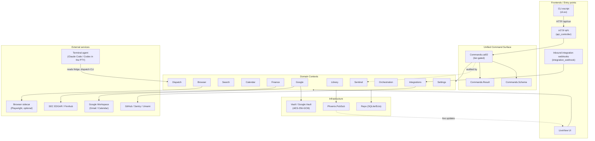
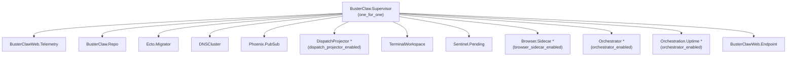
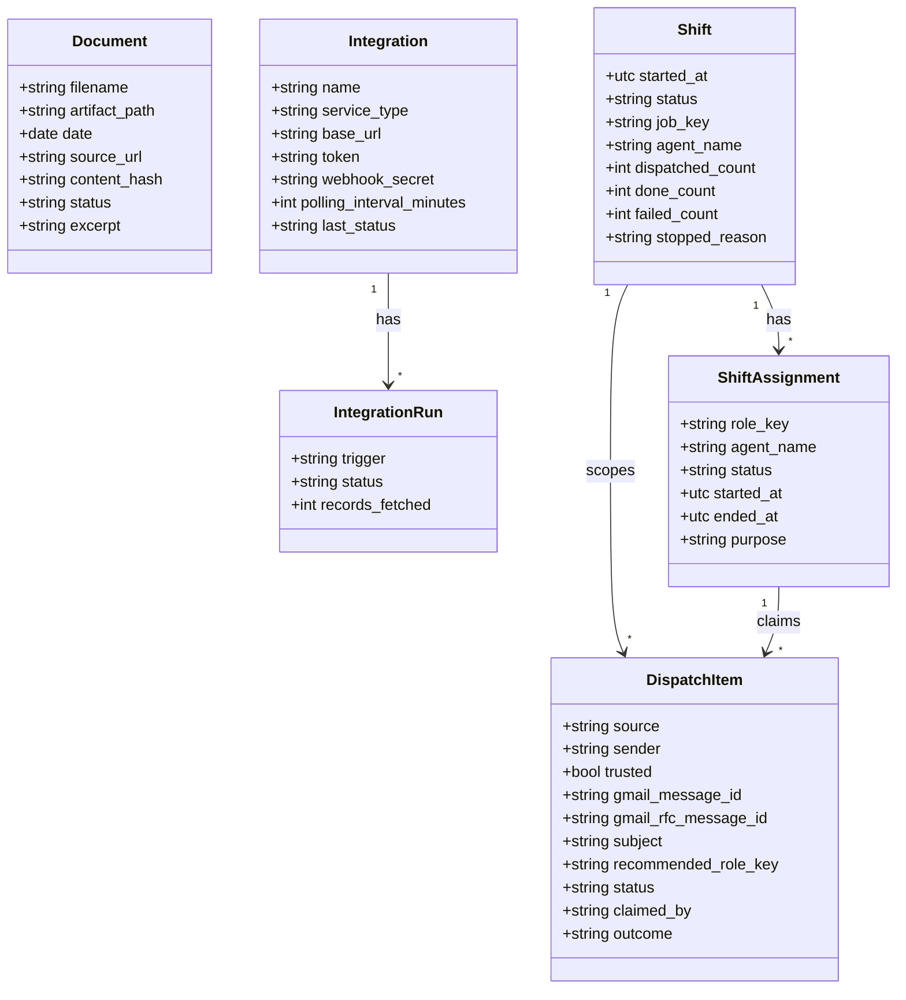
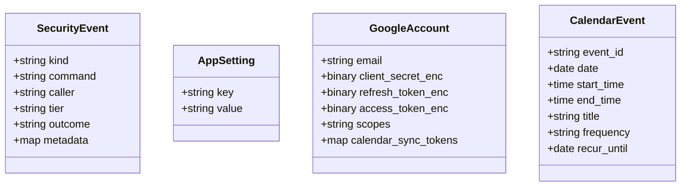
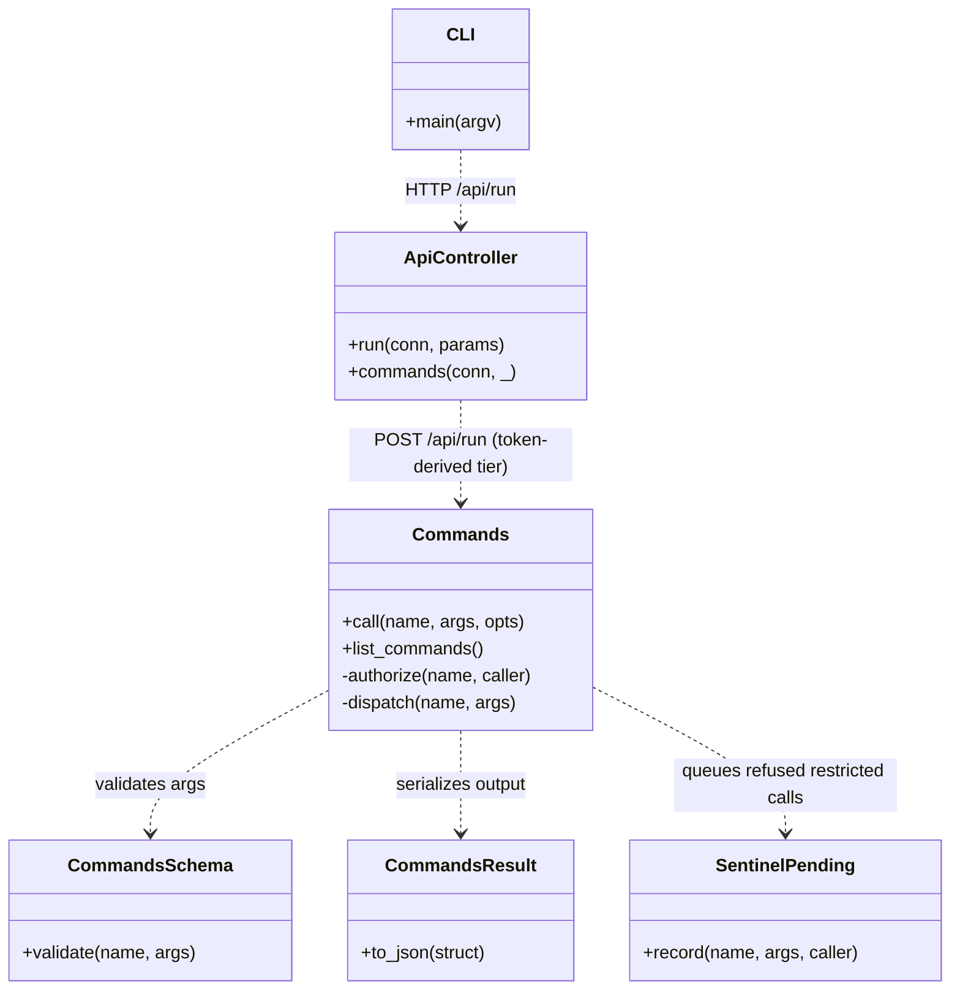
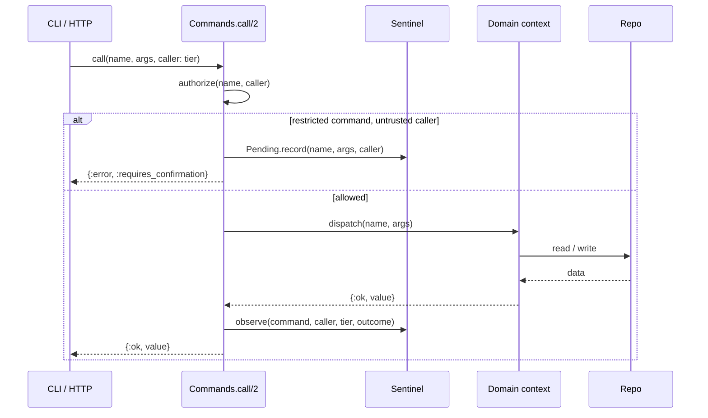
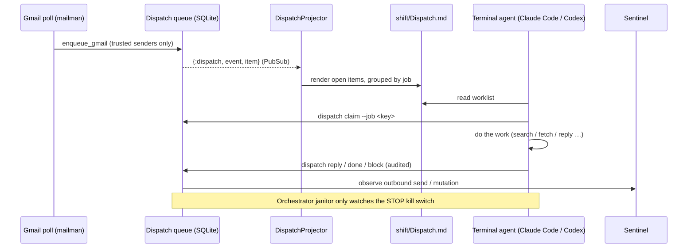
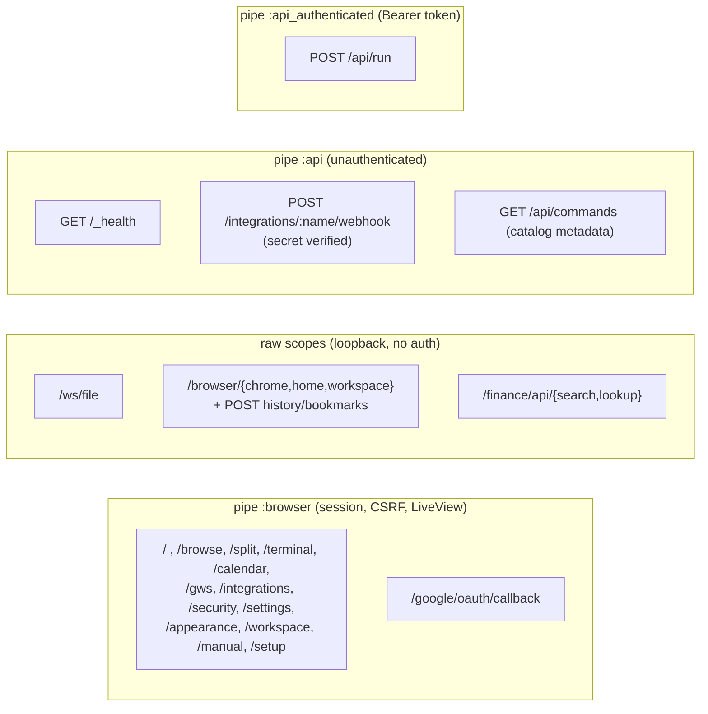

# Buster Claw — UML / Architecture Diagrams

Mermaid diagrams describing both the **structure** (modules, schemas, supervision) and the
**functionality** (request flows) of the codebase. Rendered automatically by GitHub and most
Markdown viewers.

> Source of truth: re-derived from `lib/` on 2026-06-14 (post pull-queue cut and the
> Delivery / Hooks / Webhooks / Scheduler / Memory retirement). Re-derive after large refactors.

---

## 1. System layers (functional overview)

How the frontends, the unified command surface, the domain contexts, and the external world
fit together. Buster Claw has no built-in LLM — the intelligence is a terminal agent
(Claude Code / Codex) running in the in-app PTY, driving the command surface over the CLI/HTTP
and pulling work from the Dispatch queue.

---

## 2. Supervision tree (runtime processes)

From `lib/buster_claw/application.ex`. `one_for_one` strategy; `*` entries are env-gated.

---

## 3. Domain model (Ecto schemas & relationships)

All persisted schemas. Standalone schemas (no FKs) are grouped at the bottom.

### Standalone schemas (no foreign keys)

---

## 4. Command surface dispatch (shared by all frontends)

The single most important design property: **one** dispatcher, multiple callers. Restricted-tier
commands are refused for an untrusted caller (the scoped `:mcp` token) and recorded in
`Sentinel.Pending`.

---

## 5. Command call & tier gate

How a single command request is authorized, dispatched, and audited.

---

## 6. The Dispatch pull-queue (terminal-driven work)

There is no headless dispatch. A human-run terminal agent reads the queue projected to the
workspace fridge, claims items, does the work, and writes results back through the audited
`buster-claw dispatch` CLI. The `Orchestrator` is a supervised janitor that only watches the
kill switch; all work state is durable in SQLite, so an OTP restart resumes mid-shift.

---

## 7. HTTP routing & auth tiers

From `lib/buster_claw_web/router.ex`.

