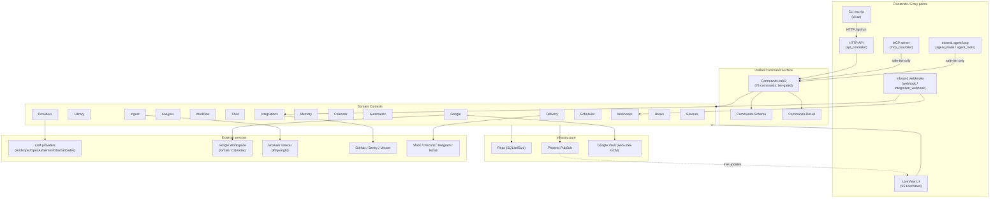
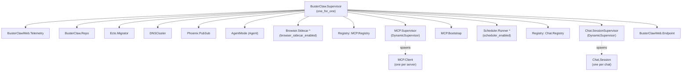
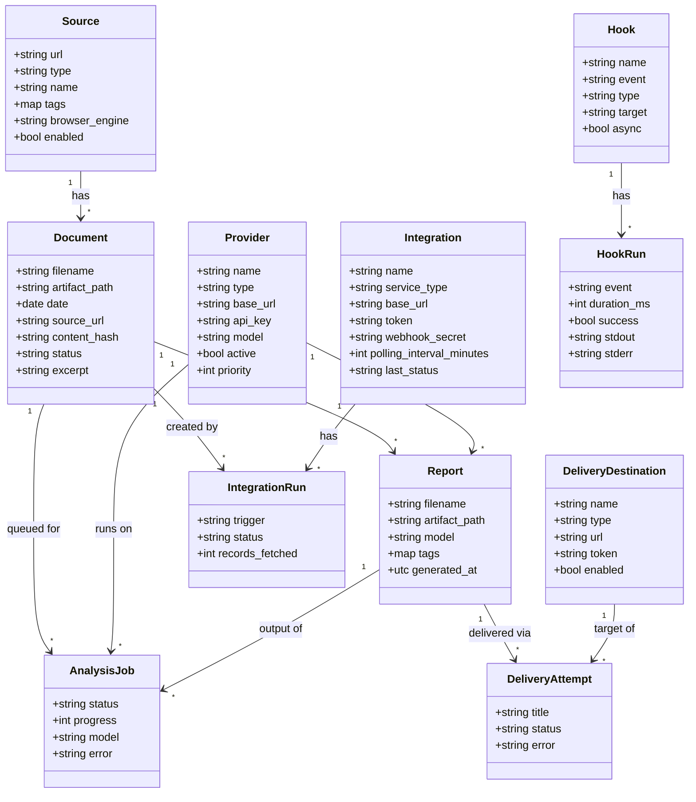
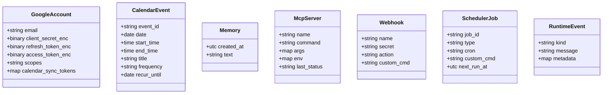
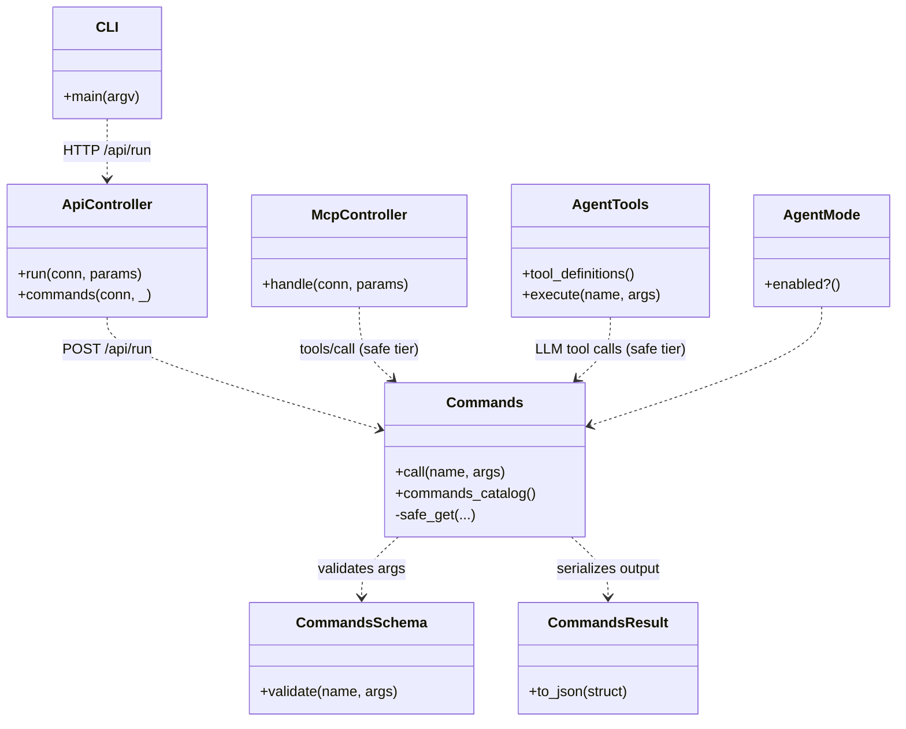
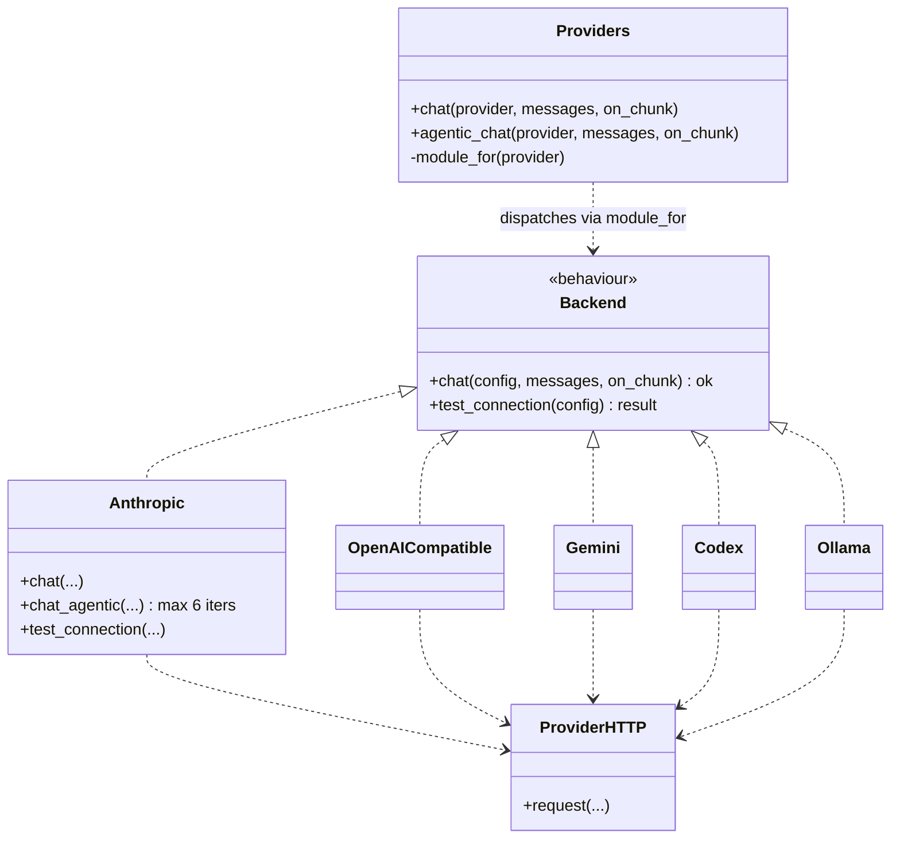
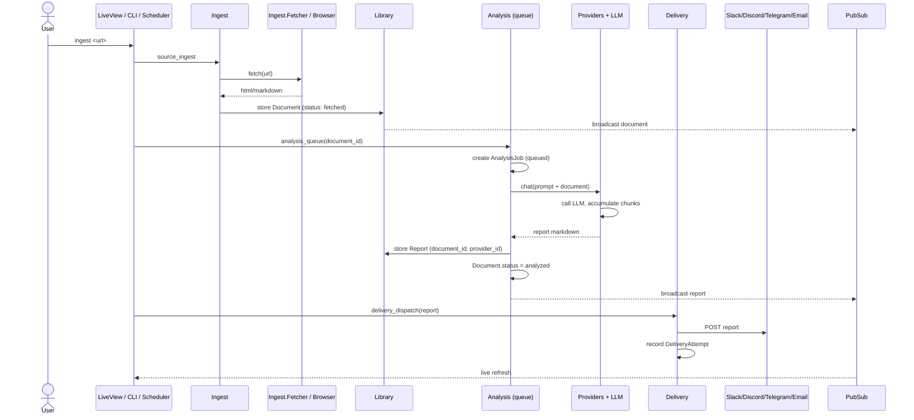
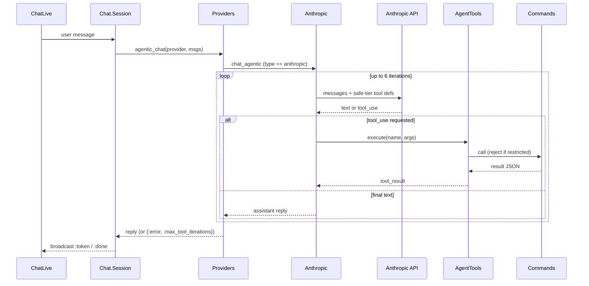
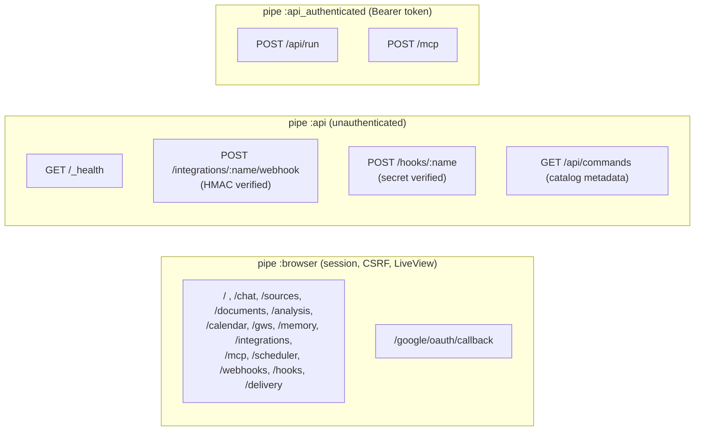

# Buster Claw — UML / Architecture Diagrams

Mermaid diagrams describing both the **structure** (modules, schemas, supervision) and the
**functionality** (request flows and pipelines) of the codebase. Rendered automatically by
GitHub and most Markdown viewers.

> Source of truth: generated from `lib/` on 2026-05-28. Re-derive after large refactors.

---

## 1. System layers (functional overview)

How the four frontends, the unified command surface, the domain contexts, and the
external world fit together.

---

## 2. Supervision tree (runtime processes)

From `lib/buster_claw/application.ex`. `one_for_one` strategy; `*` entries are env-gated.

---

## 3. Domain model (Ecto schemas & relationships)

All persisted schemas and their associations. Standalone schemas (no FKs) are grouped at
the bottom.

### Standalone schemas (no foreign keys)

---

## 4. Command surface dispatch (shared by all frontends)

The single most important design property: **one** dispatcher, four callers. Restricted-tier
commands are filtered out for the model-facing frontends (MCP, agent loop).

---

## 5. LLM provider abstraction

`Backend` behaviour with per-provider implementations, dispatched by `module_for/1`. Only
Anthropic implements the agentic tool loop today (others fall back to plain chat).

---

## 6. Knowledge pipeline (ingest → analyze → deliver)

The core functional loop, including the queue-based async analysis and PubSub-driven
live updates.

---

## 7. Agentic chat loop (Anthropic tool-calling)

How a chat turn becomes tool calls against the command surface, with the safe-tier gate
and the 6-iteration cap.

---

## 8. HTTP routing & auth tiers

From `lib/buster_claw_web/router.ex`.

